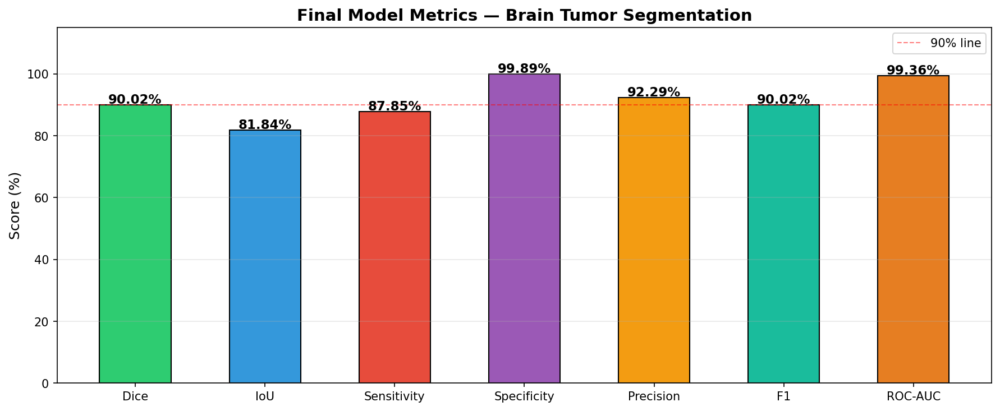
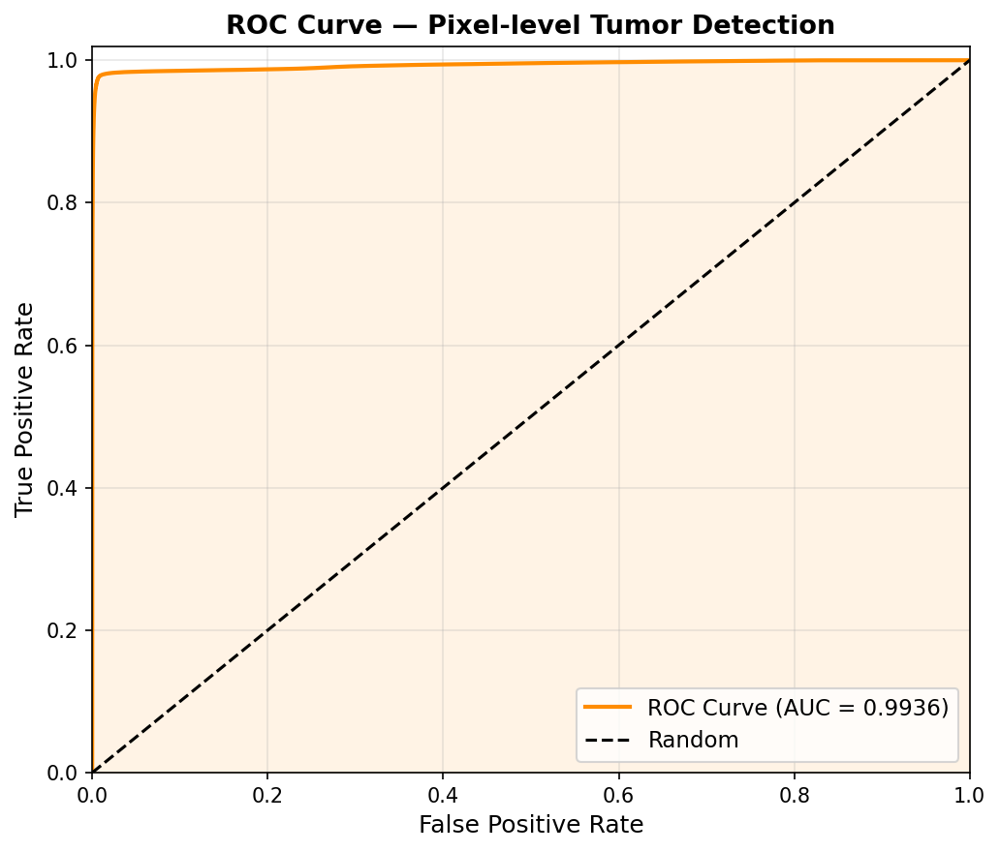
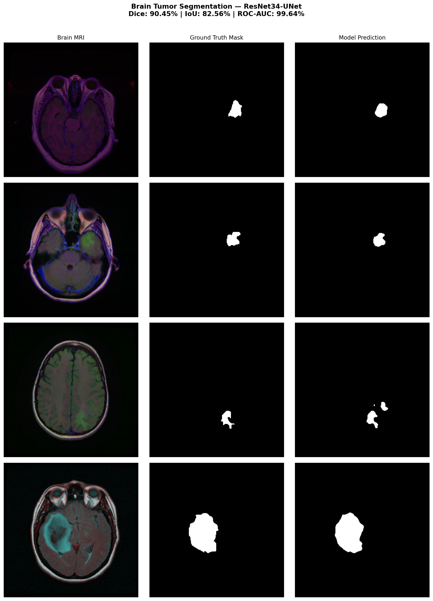
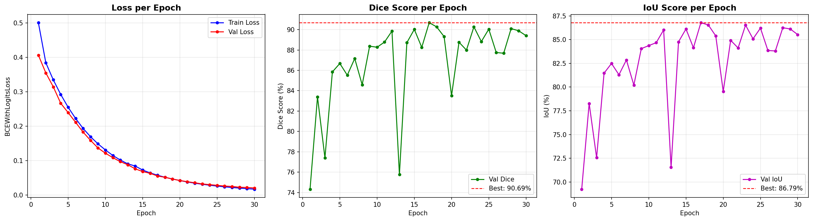
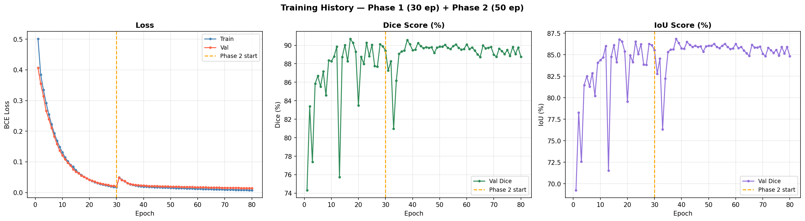
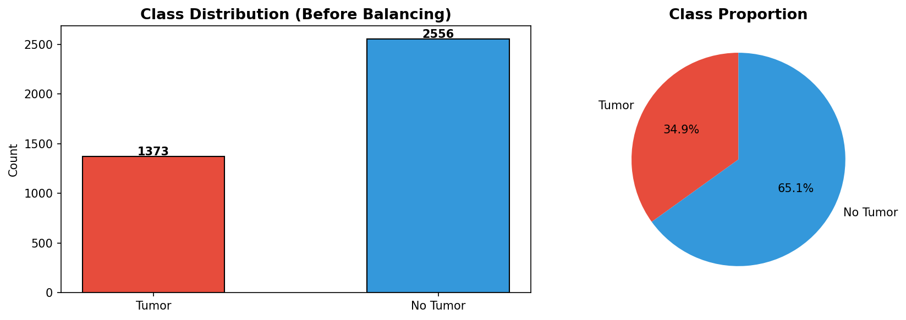
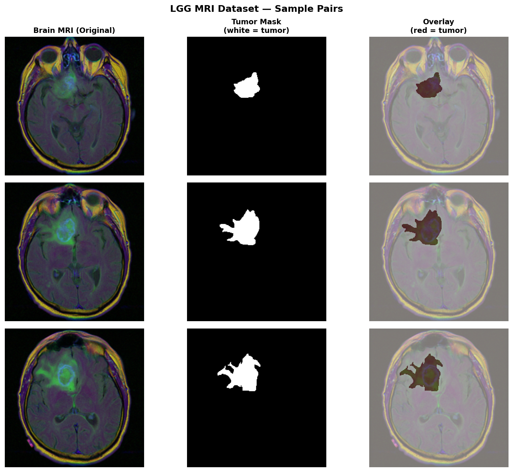

<div align="center">

# 🧠 Brain Tumor Segmentation — ResNet34-UNet

**Pixel-level brain tumor segmentation using Transfer Learning on LGG MRI Dataset**

[](https://python.org)
[](https://pytorch.org)
[](#results)
[](#results)
[](https://huggingface.co/spaces/yashikasharma2004/brain-tumor-segmentation)

</div>

---

## 📌 Overview

This project implements **pixel-level binary segmentation** of brain tumors from FLAIR MRI scans using a **ResNet34-UNet hybrid architecture** with ImageNet pretrained weights. The model achieves **90.02% Dice Score** and **99.36% ROC-AUC** on the LGG MRI Segmentation Dataset.

> **Clinical Relevance:** Accurate tumor boundary delineation is critical for surgical planning, radiotherapy targeting, and treatment monitoring. This model automates a task that typically takes radiologists 20–30 minutes per patient.

---

## 🏆 Results

| Metric | Score |
|--------|-------|
| 🎯 **Dice Score** | **90.02%** |
| 📐 **IoU (Jaccard)** | **81.84%** |
| 🔍 **Sensitivity (Recall)** | **87.85%** |
| 🛡️ **Specificity** | **99.89%** |
| 🎯 **Precision** | **92.29%** |
| ⚖️ **F1-Score** | **90.02%** |
| 📈 **ROC-AUC** | **99.36%** |

### Metrics Visualization


### ROC Curve


---

## 🔬 Sample Predictions

The model accurately delineates tumor boundaries across varying sizes, shapes, and locations:



*Columns: Brain MRI (FLAIR) | Ground Truth Mask | Model Prediction | Overlay*

---

## 📊 Training History

### Phase 1 (30 Epochs) — Feature Extraction


### Full Training (Phase 1 + Phase 2 Fine-Tuning — 80 Epochs)


Training was done in **two phases** — initial feature extraction with frozen ResNet34 encoder (30 epochs), followed by end-to-end fine-tuning (50 epochs) with a reduced learning rate.

---

## 📂 Dataset



| Property | Value |
|----------|-------|
| **Source** | [LGG MRI Segmentation — Kaggle](https://www.kaggle.com/datasets/mateuszbuda/lgg-mri-segmentation) |
| **Patients** | 110 |
| **Total Images** | 3,929 (MRI + Mask pairs) |
| **Tumor Images** | 1,373 (34.9%) |
| **No-Tumor Images** | 2,556 (65.1%) |
| **Image Type** | FLAIR MRI (Brain axial slices) |
| **Task** | Binary segmentation (tumor / no-tumor) |

### Sample Data


*Columns: Brain MRI (Original) | Tumor Mask (white = tumor) | Overlay (red = tumor)*

---

## 🏗️ Architecture

```
Input (256×256×3)
       │
  ┌────▼────────────────────────────┐
  │   ResNet34 Encoder (ImageNet)   │  ← Pretrained, frozen in Phase 1
  │   5 stages → feature maps       │
  └────┬────────────────────────────┘
       │  skip connections ──────────┐
  ┌────▼────────────────────────────┐ │
  │       U-Net Decoder             │◄┘
  │   4× upsampling + conv blocks   │
  └────┬────────────────────────────┘
       │
  ┌────▼────────┐
  │  Sigmoid    │  → Binary Mask (256×256×1)
  └─────────────┘
```

| Component | Detail |
|-----------|--------|
| **Encoder** | ResNet34 (ImageNet pretrained) |
| **Decoder** | U-Net with skip connections |
| **Loss Function** | BCE with Logits Loss |
| **Optimizer** | Adam |
| **Phase 1 LR** | 1e-4 (encoder frozen) |
| **Phase 2 LR** | 1e-5 (full model fine-tuned) |
| **Input Size** | 256 × 256 px |
| **Total Epochs** | 80 (30 + 50) |
| **Batch Size** | 16 |

---

## 🛠️ Tech Stack

- **Framework:** PyTorch
- **Architecture Library:** segmentation-models-pytorch
- **Pretrained Backbone:** ResNet34 (ImageNet)
- **Training Platform:** Kaggle (GPU T4)
- **Data Augmentation:** Horizontal flip, vertical flip, rotation, elastic transform

---

## 🚀 Quick Start

### Installation
```bash
git clone https://github.com/yashikasharma2004/brain-tumor-segmentation-resnet-unet.git
cd brain-tumor-segmentation-resnet-unet
pip install torch torchvision segmentation-models-pytorch opencv-python matplotlib scikit-learn albumentations
```

### Dataset Setup
Download from Kaggle: [LGG MRI Segmentation Dataset](https://www.kaggle.com/datasets/mateuszbuda/lgg-mri-segmentation)

### Run Inference
```python
import torch
import segmentation_models_pytorch as smp
from PIL import Image
import numpy as np

# Load model
model = smp.Unet(encoder_name="resnet34", encoder_weights=None, in_channels=3, classes=1)
model.load_state_dict(torch.load("resnet_unet_best.pth", map_location="cpu"))
model.eval()

# Predict
img = np.array(Image.open("brain_mri.jpg").resize((256, 256))) / 255.0
img_tensor = torch.tensor(img.transpose(2, 0, 1), dtype=torch.float32).unsqueeze(0)

with torch.no_grad():
    mask = torch.sigmoid(model(img_tensor)).squeeze().numpy()

tumor_mask = (mask > 0.5).astype(np.uint8)
```

---

## 📁 Repository Structure

```
brain-tumor-segmentation-resnet-unet/
├── notebooka0571a011c.ipynb      # Full training notebook (Kaggle)
├── sample_predictions.png        # Model predictions vs ground truth
├── training_curves_phase1.png    # Phase 1 training history
├── training_curves_combined.png  # Full 80-epoch training history
├── metrics_bar_chart.png         # Performance metrics visualization
├── roc_curve.png                 # ROC-AUC curve
├── class_distribution.png        # Dataset class balance
├── sample_data.png               # Sample MRI + mask pairs
└── README.md
```

---

## 🌐 Live Demo

Try the model live — upload a brain MRI scan and get instant tumor segmentation:

**👉 [Launch Demo on Hugging Face Spaces](https://huggingface.co/spaces/yashikasharma2004/brain-tumor-segmentation)**

---

## 👩‍💻 Author

**Yashika Sharma**  
B.Tech CSE (AI/ML) | Passionate about Medical AI & Computer Vision

[](https://github.com/yashikasharma2004)

---

## 📄 License

This project is open-source under the [MIT License](LICENSE).
